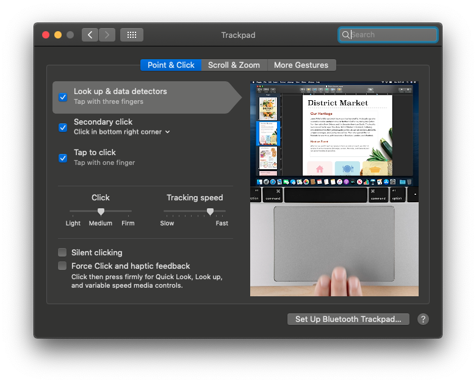

# Hackintosh-Toshiba-L55W-C5320

## Notebook Specs:

Processor: 2,39 GHz Dual-Core Intel Core i7 5500u

Memory: 12 GB 1600 MHz DDR3

Graphics: Intel HD Graphics 5500 1536 MB

## Perfectly Working Features:

- Audio
- Microphone
- Integrated Intel Graphics (hd 5500)
- Multitouch gestures
- Full keyboard working (Using "US-International PC" input sources)
- Keyboard backight control
- Volumen Keyboards
- Num keys
- USB 3.0
- Web camera
- Wifi and Bluetooth using this card and adaptor (Sodial Bcm94360Cs2 - Adaptator BCM94360CS2 BCM943224PCIEBT2 A M2 (M.2 NGFF) A E Key)
- Sleep with DSDT Patches
- Battery Percentage
- Siri
- AirDrop
- Night Shift
- SD Card Reader
- HDMI audio

## Not Working:

- Input jack micro (work in progress)
- IMessage and FaceTime (work in progress)
    
## Clover:
- Version 5119    
 
## Kexts:

- AppleALC
- Lilu
- Sinetek-rtsx
- NoTouchID
- SMCBatteryManager
- SMCProcessor
- SMCSuperIO
- USBPorts (made for this notebook using Hackintool)
- VoodooPS2Controller
- WhateverGreen

## Drivers:
Save drivers in BIOS's folder because it's better to use mbr partition to avoid graphical glitches.

- ApfsDriverLoader
- FSInject
- VirtualSmc
- XhciDxe

## Catalina 10.15.5

## Sleep Configurations

It's important to disable "Wake for Wi-Fi network access to avoid wifi problems"

It's important to disable "Allow Bluetooth devices to wake this computer"

## Keyboard 

## Trackpad 

## Gallery

## Credits

- [Acidanthera](https://github.com/acidanthera)
  - [AppleALC](https://github.com/acidanthera/AppleALC)
  - [Lilu](https://github.com/acidanthera/Lilu)
  - [VirtualSMC](https://github.com/acidanthera/VirtualSMC)
  - [WhateverGreen](https://github.com/acidanthera/WhateverGreen)
- [RehabMan](https://github.com/RehabMan)
- [VoodooI2C Developer Team](https://voodooi2c.github.io/#Credits%20and%20Acknowledgments/Credits%20and%20Acknowledgments)

